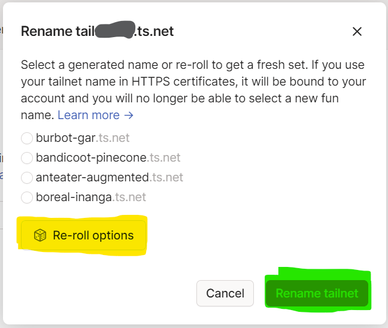

Installing on custom hardware (Linux)
=====================================

.. note::

    This guide is not finished yet! Check back later.

.. warning::
    **DO NOT DO THIS ON YOUR MAIN COMPUTER**

    **THIS SHOULD BE PERFORMED ON THE HARDWARE THAT WILL BE TURNED INTO YOUR SERVER**

    **DOING THIS WILL OVERWRITE EVERYTHING STORED ON THAT HARDWARE**

    **DO NOT DO THIS ON YOUR MAIN COMPUTER**

System Requirements
-------------------

+------------------+-------------------------------------+
| CPU              | Dual-core x64 bit                   |
+------------------+-------------------------------------+
| Memory (RAM)     | **6 GB** or more (8 GB recommended) |
+------------------+-------------------------------------+
| Internal Storage | **64 GB** or more                   |
+------------------+-------------------------------------+
| External Storage | As much (or little) as you please   |
+------------------+-------------------------------------+

If you are currently running Windows, here's how to check them:

* Click `here <ms-settings:about>`_ (click "Open" in the pop-up, this is a direct link to the relevant setting, it is not harmful)
* Scroll down to "Device specifications"
* CPU: Look at "System Type". If it says "64-bit operating system, x64-based processor", you can continue!
* RAM: Look at "Installed RAM". If it says "6.00 GB" or any higher value, you can continue

Install Debian
--------------

.. note::
    This step is very complicated and can often lead to errors.

    If you are unsure about any step, don't hesitate to ask in the `Discord <https://discord.gg/P4HHG3fHXS>`_!

First, download the `Debian installer <https://www.debian.org/download>`_.

*(The link on the page to download the installer looks like this: "debian-XX.X.X-amd64-netinst.iso")*

Then, burn it onto a USB using `Rufus <https://www.uubyte.com/how-to-use-rufus.html#4>`_.

Restart your device and boot from the USB Drive.

*(This varies from manufacturer to manufacturer, google "How to enter boot menu on [Device Manufacturer], [Device Model]")*

Once you did that, `here <https://youtu.be/gddlhr9ST9Y?t=132>`_'s a tutorial on how to install Debian once you are in the installer.

When partitioning the drives, setup your external storage under the "/mnt/storage" path.

When asked, **enable** "SSH Server".

Setup Tailscale
---------------

You should now be in the Debian Environment.

1. Click "Activities" and open Firefox.
2. Open the Tailscale Page (`https://tailscale.com <https://tailscale.com>`_) and press "Log in".
3. Login with your desired Identity Provider.
4. Click "I'm already familiar with tailscale, skip" (grey text in the bottom of the Setup window).

.. image:: ./images/tailscale-admin.png
   :width: 800px

5. Press on "Activities", search for "Terminal" and open it.
6. Type in ``su -``, press Enter and type in the **ROOT** password you set earlier.
7. Run this command: ``apt-get update && apt-get upgrade -y && apt-get install curl snapd git``.
8. Run this command: ``curl -fsSL https://tailscale.com/install.sh | sh``.
9. Run this command: ``tailscale up``.

Now get back to Firefox but **leave the terminal open!**
                            
10. Using the three dots, rename the device that hosts your NextCloud to something you can easily remember, plain "nextcloud" for example. **DON'T name it something that can personally identify you, like your first and last name / address / etc.**
11. Click on the three dots, and then press on "Disable key expiry" and confirm if necessary.
12. If your main device contains something, that can personally identify you, rename it as well.
13. Navigate to the DNS page. It should look like this:

.. image:: ./images/tailscale-dns.png
   :width: 800px

14. Press "Rename tailnet..."
15. A box should pop up that looks like this:

16. You now have 4 options of how your network will be named. If you don't like any of them, press "Re-roll options". If you find one you like, choose it and press "Rename tailnet"
17. Scroll down to the very bottom and click "Enable HTTPS..." and in the dialogue, click "Enable".

Continue with the next step!

Install NextCloud
-----------------

.. note::
    This assumes that in (:ref:`Setup Tailscale`), you named your device "nextcloud". If not, in step number 5, 7 and 8, change "nextcloud" to whatever you named the device.

1. Back in the Terminal, run this command: ``sudo usermod -aG sudo [your username]``, after it's done, restart your device!
2. In a new Terminal window, run ``su -``.
3. Now run ``snap install nextcloud``.
4. Run ``snap connect nextcloud:removable-media``.
5. Run ``nextcloud.manual-setup [choose a username] [choose a password]``. **These credentials are going to be your credentials for logging into the NextCloud interface. Make sure you follow the basic rules of a password or use a Password Manager** (for example `BitWarden <https://bitwarden.com>`_)
6. Run ``nextcloud.occ config:system:set trusted_domains 1 --value=nextcloud.[your tailscale network name from the step above]``.
7. Run ``mkdir -p /var/snap/nextcloud/current/certs/custom && cd /var/snap/nextcloud/current/certs/custom``.
8. Run ``tailscale cert nextcloud.[your network name from step above]``
9. Run ``nextcloud.enable-https custom nextcloud.[your network name from step above].crt nextcloud.[your network name from step above].key nextcloud.[your network name from step above].crt``.
10. Run ``cd ~``.

You can now access NextCloud from your Browser and any Device connected to Tailscale.

Visit "nextcloud.[your network name from step above]" and log in to see it in action!

You are **not** done yet. Continue to the next step!

Setup External Storage in NextCloud
-----------------------------------

1. Once you have your NextCloud Dashboard open, click on your profile icon in the top right corner.
2. Click on "+ Apps".
3. Scroll down until you see "External storage support" and enable it.
4. Click on your profile icon again and open "Administration settings".
5. On your left side, scroll down until you see "External storage" and click it.
6. In "Folder name" type in a name for your folder. It is not important.
7. In the "Add storage" selection box, choose "Local".
8. In the "Location" text box, type in "/mnt/storage".
9. Under "Available for", tick "All users".
10. Press the save (tick) button at the very right.
11. Go to Files by clicking the Folder logo in the top left corner.
12. On the left side, press "External storage".
13. Click on the folder there, it will have the name that you just set.

You are now using the External Storage in NextCloud.

.. note::
    There may be a folder already there that's named "lost+found". It is part of Debian's ext4 file system and is not important for you. You cannot delete it and it's size will show up as "Pending". It is not large enough to cause any problems, and if you run out of storage, this folder is not the cause. You can safely ignore it.

NextCloud is now set up properly. You could technically stop here. To access your files, install the Tailscale App on every device you're trying to access your NextCloud instance from. You **must** be connected to Tailscale to be able to connect to your NextCloud. There are also apps for NextCloud available on every popular operating system, from which you can access all your files without having to open the browser. Note that you still need to be connected to Tailscale when using these apps. Make sure you do regular backups of your data, jkdev or "Docs of our own" are not responsible for any data loss!

If you want to have a more "Google Docs"-like experience, continue below with setting up OnlyOffice

Setup OnlyOffice
----------------

Now you will setup your office suite.

1. In the Terminal, run ``curl -fsSL https://get.docker.com | sh``
2. Run: ``curl -fsSL https://prev.jkdev.run/do3-oo-setup | bash``
3. After this is done, run the First Startup command.

