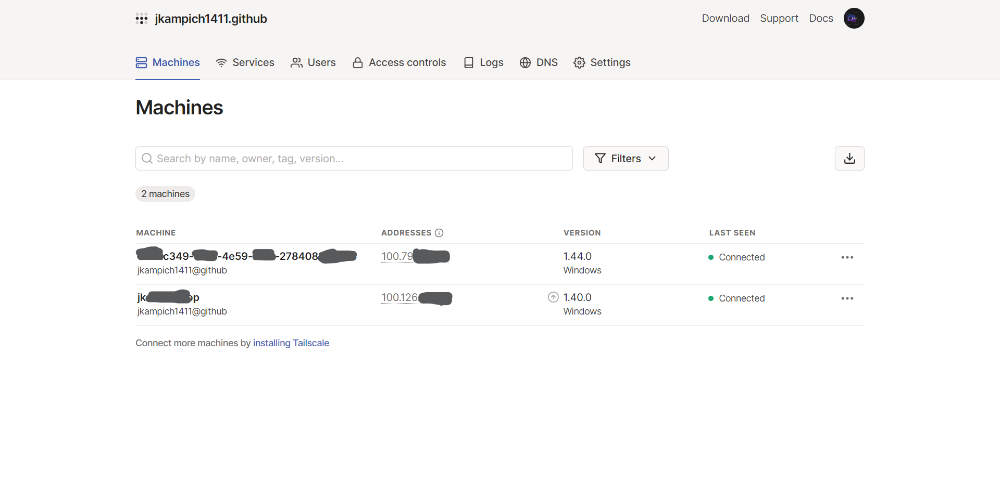
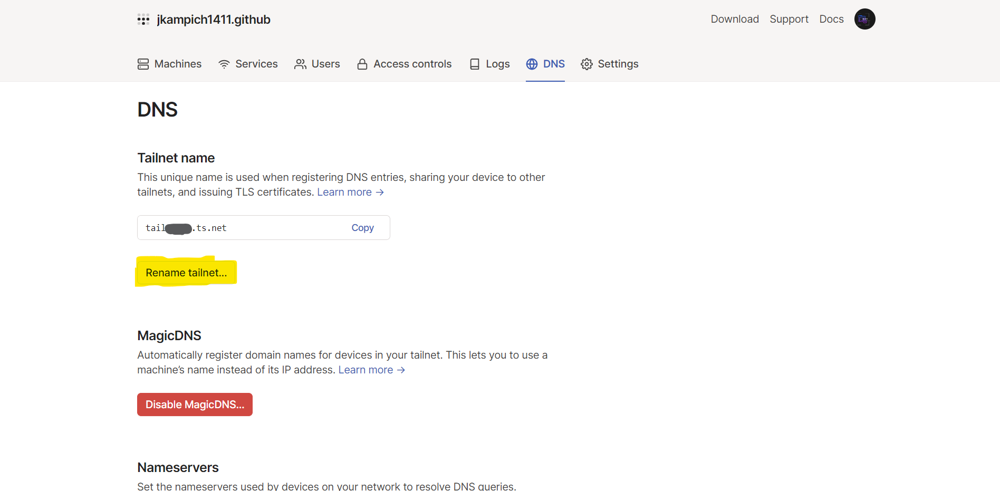
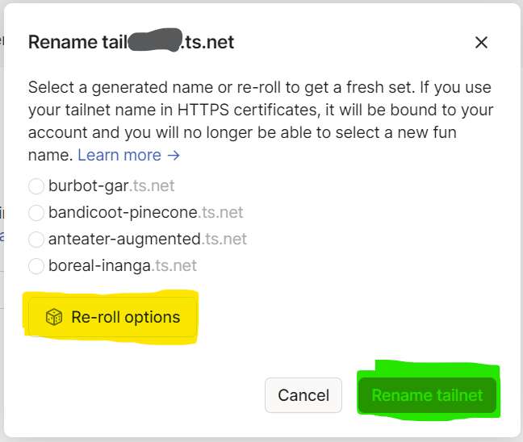

Installing on custom hardware (Windows)
=======================================

.. note::

    This guide is not finished yet! Check back later.

.. note::

    This guide assumes, that you are using an old Windows device.
    If you want to use an old MacOS device, use (:doc:`custom-macos`)

.. note::
    This guide is designed to be open on your old Windows Device, as it includes direct links to device settings.
    If you don't have this webpage open on your old device, open it there!

System Requirements
-------------------

+--------------+---------------------+
| CPU          | 64-bit architecture |
+--------------+---------------------+
| Memory (RAM) | **6 GB** or more    |
+--------------+---------------------+

How to check these:

* Click `here <ms-settings:about>`_ (click "Open" in the pop-up, this is a direct link to the relevant setting, it is not harmful)
* Scroll down to "Device specifications"
* CPU: Look at "System Type". If it says "64-bit operating system, x64-based processor", you can continue!
* RAM: Look at "Installed RAM". If it says "6.00 GB" or any higher value, you can continue

Setup Tailscale
---------------
1. Open the Tailscale Page (`https://tailscale.com <https://tailscale.com>`_) and press "Log in".
2. Login with your desired Identity Provider.
3. Open the Windows Installation instructions (`https://tailscale.com/download/windows <https://tailscale.com/download/windows>`_) in another tab. After you're done, you can close it again.
4. Your first tab should now say "Next, add a second device"
5. You now need to install Tailscale onto your main computer. Open (`https://tailscale.com/download <https://tailscale.com/download>`_) and follow the setup for your OS. 
6. Once you're done, the first tab should've changed again. Press "Success, it works" and then "Go to admin console".
7. You should now have something like this in front of you:

8. Using the three dots, rename the device that hosts your NextCloud to something you can easily remember, plain "nextcloud" for example. **DON'T name it something that can personally identify you, like your first and last name / address / etc.**
9. Click on the three dots, and then press on "Disable key expiry" and confirm if necessary.
10. If your main device contains something, that can personally identify you, rename it as well.
11. Navigate to the DNS page. It should look like this:

12. Press "Rename tailnet..."
13. A box should pop up that looks like this:

14. You now have 4 options of how your network will be named. If you don't like any of them, press "Re-roll options". If you find one you like, choose it and press "Rename tailnet"
15. Scroll down to the very bottom and click "Enable HTTPS..." and in the dialogue, click "Enable".

Continue with the next step!

Install Docker
--------------

1. Open the Run prompt (Windows + R), type in ``wsl --install -d Debian`` and press Enter.
2. Once that is done, open the Docker Download page (`https://docs.docker.com/desktop/install/windows-install <https://docs.docker.com/desktop/install/windows-install>`_), download the installer and run it.
3. Follow the setup instructions, you don't need to change any settings.

