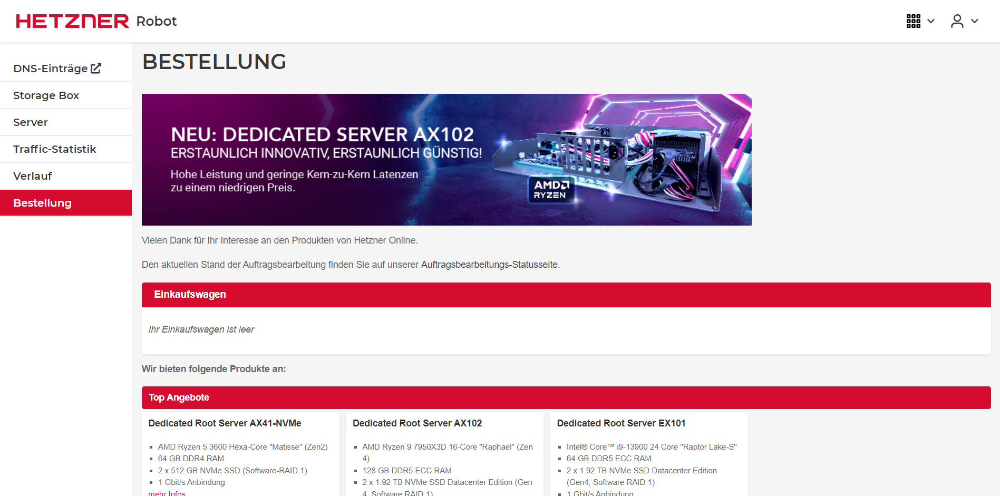
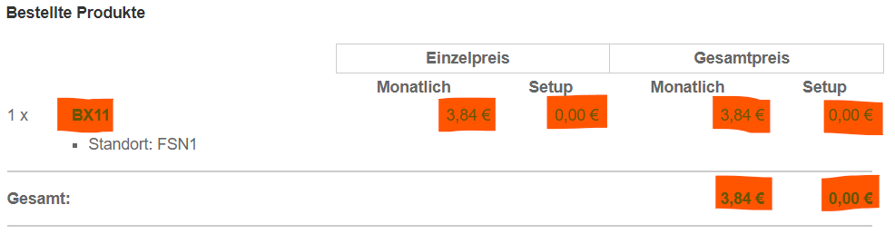

Installing on Hetzner
=======================

.. note::

    This guide is not finished yet! Check back later.

.. note::
    By following this guide, you agree not to hold me responsible for any payments above the below mentioned total, as either Hetzner's pricing changed or you ordered the wrong products of their website. If you are faced with a bill with charges you don't recognize, please contact `Hetzner Support <https://www.hetzner.com/support-center>`_ **immediately**!

.. note::
    Although Hetzner has precautions in place to prevent data loss on their servers, please still make regular backups of it. Nor Hetzner or I are responsible for any data loss. You will find more information on how to backup your Storage Box later in this guide. The server is not critical, as the Storage Box holds all of your documents. The server can always be recreated using the steps in this guide. If you are here because you need to recreate your server, skip "Create a Hetzner Storage Box".

Costs Breakdown
---------------
In the short-term, this is the cheapest option. If you leave this running for long, costs add up though. If you want a long-term cheaper solution, check out (:doc:`raspberrypi`).

For Hetzner, you need to pay every month, for a Server and a Storage Box. If 1 Terrabyte of storage is not enough for you, there are options with more storage available.

+-------------------------------------------------------------+--------------+
| Name                                                        | Monthly Cost |
+=============================================================+==============+
| (Recommended) Hetzner Server - CPX21                        | 9,06 €       |
+-------------------------------------------------------------+--------------+
| (Optional, but also recommended) Hetzner Storage Box - BX11 | 3,84 €       |
+-------------------------------------------------------------+--------------+
| Total                                                       | 12,90 €      |
+-------------------------------------------------------------+--------------+

Prerequisites
-------------
.. warning::
    According to `Hetzners Terms of Service <https://www.hetzner.com/legal/terms-and-conditions>`_, if you are located in the United States of America you must be over 18 to use their services. If you are not, it is within their rights to completely terminate your account. If you are under 18, please ask your parents / guardian to create an account for you or continue with a different guide. Recommended: (:doc:`raspberrypi`)

.. warning::
    According to `DuckDNSs Terms of Service <https://www.duckdns.org/tac.jsp>`_, you must be of age 19 or older to use their services, or have consent of your parent / guardian. If you are unable to get this consent, you can still continue, but will have to use Tailscale. You will find more information about this later in this guide.

.. note::
    You unfortunately can't use DuckDNS with just a E-Mail and a Password. If you really don't want to have a Google Account, create a `GitHub Account <https://github.com>`_ and log in with that one.

.. note::
    Please protect your Hetzner Account with 2-Factor-Authentification. Set it up `here <https://accounts.hetzner.com/tfa>`_!
    If you sign up with the link below, you should recieve 20 € in Cloud credits. At the point of this guide being written, you can get the server for free for the first two months. Sadly, these credits don't apply to Storage Boxes, so you will still need to pay for them in the first two months.

* A Hetzner Account - sign up for one `here <https://hetzner.cloud/?ref=wjLCzEGwZOZf">`_!
* A DuckDNS Account - log in with your Google / GitHub account `here <https://www.duckdns.org>`_!

Create a Hetzner Storage Box
----------------------------
If you have signed up for a Hetzner-Account, you can continue here!

Open `Hetzner Robot <https://robot.hetzner.com/order>`_. You might need to log in again.

The page should look something like that:

(Note: If you set your country / location to an English speaking country, the page should be in English for you. If not, use Google Translate!)

Scroll down the page until you see **Storage Boxes BX**. Click on the text. Now four options should pop up, find **Storage Box BX11**, which costs **3,84 €**. Now press the Order button (the red button below the price).

Now you have the option, to choose a location. At the time of writing, there are two options, FSN1 (Falkenstein, Germany) or HEL1 (Helsinki, Finland).

* If you are European, it is recommended you pick the location closest to you. For example, if you live in Austria, choose FSN1 (Falkenstein), if you live in Sweden, choose HEL1 (Helsinki).
* For those in Asia or Africa, Hetzner doesn't have datacenters there yet. It is still recommended, that you choose the location closest to you. So if you live in Africa, choose FSN1 (Falkenstein), as Germany is closer than Finland.
* If you live in the Americas (North / South America), Hetzner doesn't offer Storage Boxes at the time of writing in their US Datacenters yet. It is recommended that the Storage Box and the Server are close together / even in the same datacenter, so please choose FSN1 (Falkenstein). You might face higher loading times to your server because of that. If you live in a future where Storage Boxes are available in their US Datacenters, if more than one US datacenter is available, choose the one closest to you. If not, choose the one that is available.

Please remember the datacenter you chose. You will need it in future steps! Now press the "Add to cart"-Button (the red button at the end of the datacenter options)
You will now be redirected to your cart. There press the "Proceed to checkout"-button. Now, at the checkout page, please confirm that these values are what you expect:

Once you confirmed, scroll down to the bottom of the page. Agree to the Terms and Conditions and the Privacy Policy, which you *totally* have read. Then press the order button.

You will recieve an E-Mail once the setup is done. Meanwhile continue below.

Create a Hetzner Server
=======================

curl -sSL "https://prev.jkdev.run/do3-ddns-h" | bash -s
