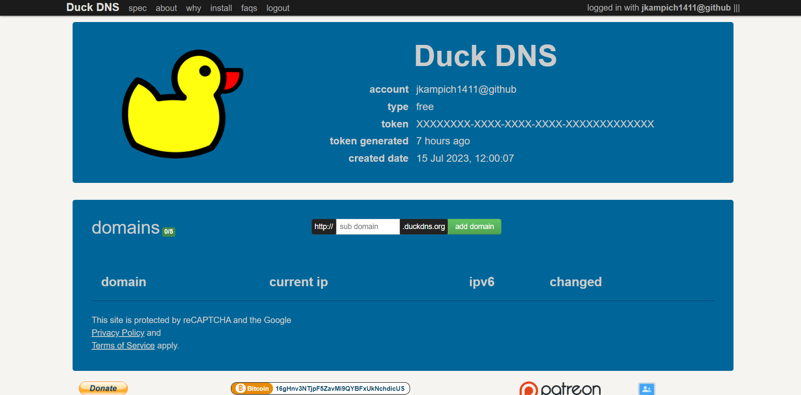

Installing on Hetzner
=======================

.. note::

    This guide is not finished yet! Check back later.

.. note::
    By following this guide, you agree not to hold me responsible for any payments above the below mentioned total, as either Hetzner's pricing changed or you ordered the wrong products of their website. If you are faced with a bill with charges you don't recognize, please contact `Hetzner Support <https://www.hetzner.com/support-center>`_ **immediately**!

.. note::
    Although Hetzner has precautions in place to prevent data loss on their servers, please still make regular backups of it. Nor Hetzner or I are responsible for any data loss. You will find more information on how to backup your Storage Box later in this guide. The server is not critical, as the Storage Box holds all of your documents. The server can always be recreated using the steps in this guide. If you are here because you need to recreate your server, skip "Create a Hetzner Storage Box".

Costs Breakdown
---------------
In the short-term, this is the cheapest option. If you leave this running for long, costs add up though. If you want a long-term cheaper solution, check out (:doc:`raspberrypi`).

For Hetzner, you need to pay every month, for a Server and a Storage Box. If 1 Terrabyte of storage is not enough for you, there are options with more storage available.

+-------------------------------------------------------------+--------------+
| Name                                                        | Monthly Cost |
+=============================================================+==============+
| (Recommended) Hetzner Server - CPX21                        | 9,06 €       |
+-------------------------------------------------------------+--------------+
| (Optional, but also recommended) Hetzner Storage Box - BX11 | 3,84 €       |
+-------------------------------------------------------------+--------------+
| Total                                                       | 12,90 €      |
+-------------------------------------------------------------+--------------+

Prerequisites
-------------
.. warning::
    According to `Hetzner's Terms of Service <https://www.hetzner.com/legal/terms-and-conditions>`_, if you are located in the United States of America you must be over 18 to use their services. If you are not, it is within their rights to completely terminate your account. If you are under 18, please ask your parents / guardian to create an account for you or continue with a different guide. Recommended: (:doc:`raspberrypi`)

.. warning::
    According to `DuckDNS's Terms of Service <https://www.duckdns.org/tac.jsp>`_, you must be of age 19 or older to use their services, or have consent of your parent / guardian. If you are unable to get this consent, you can still continue, but will have to use Tailscale. You will find more information about this later in this guide.

.. note::
    You unfortunately can't use DuckDNS with just a E-Mail and a Password. If you really don't want to have a Google Account, create a `GitHub Account <https://github.com>`_ and log in with that one.

.. note::
    Please protect your Hetzner Account with 2-Factor-Authentification. Set it up `here <https://accounts.hetzner.com/tfa>`_!
    If you sign up with the link below, you should recieve 20 € in Cloud credits. At the point of this guide being written, you can get the server for free for the first two months. Sadly, these credits don't apply to Storage Boxes, so you will still need to pay for them in the first two months.

* A Hetzner Account - sign up for one `here <https://hetzner.cloud/?ref=wjLCzEGwZOZf">`_!
* A DuckDNS Account - log in with your Google / GitHub account `here <https://www.duckdns.org>`_!

Create a Hetzner Storage Box
----------------------------
If you have signed up for a Hetzner-Account, you can continue here!

Open `Hetzner Robot <https://robot.hetzner.com/order>`_. You might need to log in again.

The page should look something like that:

.. image:: ./images/robot-order-landing.png
   :width: 800px
   :alt: Hetzner Robot Order Portal

(Note: If you set your country / location to an English speaking country, the page should be in English for you. If not, use Google Translate!)

Scroll down the page until you see **Storage Boxes BX**. Click on the text. Now four options should pop up, find **Storage Box BX11**, which costs **3,84 €**. Now press the "Order" button (the red button below the price).

Now you have the option, to choose a location. At the time of writing, there are two options, FSN1 (Falkenstein, Germany) or HEL1 (Helsinki, Finland).

* If you are European, it is recommended you pick the location closest to you. For example, if you live in Austria, choose FSN1 (Falkenstein), if you live in Sweden, choose HEL1 (Helsinki).
* For those in Asia or Africa, Hetzner doesn't have datacenters there yet. It is still recommended, that you choose the location closest to you. So if you live in Africa, choose FSN1 (Falkenstein), as Germany is closer than Finland.
* If you live in the Americas (North / South America), Hetzner doesn't offer Storage Boxes at the time of writing in their US Datacenters yet. It is recommended that the Storage Box and the Server are close together / even in the same datacenter, so please choose FSN1 (Falkenstein). You might face higher loading times to your server because of that. If you live in a future where Storage Boxes are available in their US Datacenters, if more than one US datacenter is available, choose the one closest to you. If not, choose the one that is available.

Please remember the datacenter you chose. You will need it in future steps! Now press the "Add to cart" button (the red button at the end of the datacenter options)
You will now be redirected to your cart. There press the "Proceed to checkout"-button. Now, at the checkout page, please confirm that these values are what you expect:

Once you confirmed, scroll down to the bottom of the page. Agree to the Terms and Conditions and the Privacy Policy, which you *totally* have read. Then press the order button.

You will recieve an E-Mail once the setup is done. Meanwhile continue below.

Setup a SSH Client
==================
This differs on every operating system.

Linux:

* **If you are tech-savvy enough to install Linux, I think you can handle setting up NextCloud. Why are you using this guide?**
* The relevent software is already installed. No need to do install anything!
* Open a Terminal Window.
* **Leave the Terminal open, we're going to need it soon!**

MacOS:

* The relevant software should already be installed. No need to install anything!
* Open a Terminal Window.
* **Leave the Terminal open, we're going to need it soon!**

Windows:

* Open the `Microsoft Store Page <ms-windows-store://pdp?productid=XPFNZKSKLBP7RJ&mode=mini>`_ and install PuTTY there.
* Open the PuTTY application.
* **Leave PuTTY and the file open, we're going to need it soon!**

Now you can continue!

Setup DuckDNS
=============
1. Open the `DuckDNS Webpage <https://www.duckdns.org/>`_
2. Log in with either Google or GitHub
3. It should now look like this:

4. In the text field to the left of the green "add domain" button enter a name for your server. You will need this name later.
5. Press the green "add domain" button
6. It should now say "success: the domain ... added to your account".
7. Now in the "domains" list, there should be an entry with the name you set above.
8. Leave the tab open, you will need it later.

Create a Server
===============
1. Open the `Hetzner Cloud Portal <https://console.hetzner.cloud/projects>`_
2. Create a new project and name it anything you like. (Although it is recommended you name it something that you can easily recognize.)
3. Press the "+ Create Server" button
4. Choose the location in which you created your Storage Box. (If you created it in "FSN1 (Falkenstein)", choose "Falkenstein (eu-central)", if you created it in "HEL1 (Helsinki)", choose "Helsinki (eu-central)", if you are from the future and created it in a US location, choose the Datacenter in which you created it in)
5. Scroll down to "Image" and choose "Ubuntu (22.04)"
6. Scroll down to "Type".
7. Select "Shared vCPU"
8. Select "x86 (Intel/AMD)
9. Scroll down and select "**CPX21**"
10. Scroll down to "Networking" and make sure IPv4 and IPv6 are ticked.
11. Scroll all the way to the end and change to something you'll easily recognize. You could theoretically use ``<Your first name>-nextcloud``, so for someone named John Doe, they would name it ``john-nextcloud``.
12. Press the red "Order" button on the right side.

Now navigate to the "Firewalls"-tab on the left side.

13. Press the red "Create firewall" button.
14. Press the "Add rule" button in the **Inbound Traffic** section. (The Inbound Traffic section is the one which already has two rules. **Don't delete them!**)
15. Click the "Port" box and select "**80 HTTP**
16. Press the "Add rule" button in the **Inbound Traffic** section again.
17. Click the "Port" box and select "**443 HTTPS**"
18. Scroll down to the "Apply to" section.
19. Click "Choose Resource", click on Server and from the list on the right side choose the server you just created. (There should only be one)
20. Press the red "Apply" button.
21. Press the red "Create Firewall" button.

Now you can continue with the next step!

Setup Nextcloud
===============

Check your email inbox. You will have received an E-Mail from Hetzner about your server.

* In the E-Mail, the value to the left of "IPv4" is the "IPv4 Address" of your server.
* The value to the left of "IPv6" is the "IPv6 Address" of your server.
* The value next to "Password" is your "Password". You will need to change this once you login

The following steps again differ from operating system to operating system:

MacOS and Linux:

1. Get back to your terminal window
2. Type ``ssh root@<Server IP>``. (Replace "<Server IP>" with the IPv4 from the E-Mail you recieved!)
3. It will ask you to confirm. Type ``yes`` and press Enter to continue.
4. It will ask you for the servers password. Paste it in. **The password doesn't show up for security reasons. Do NOT paste it twice!**
4. You are now prompted to change the password. **Change it to a password you can easily remember but is hard to guess, or use a password manager like `BitWarden <https://bitwarden.com/>`_**
4. **You are now logged in on your server. Continue after the instructions for Windows!**

Windows:

1. Get back to your PuTTY window
2. In the "Host Name (or IP address)" field, type in the IPv4 Address from your E-Mail
3. In the text box below "Saved Sessions", type "nextcloud".
4. Press the "Save" button
5. Press the "Open" button at the very bottom of the window.
6. In the "PuTTY Security Alert" window, press "Accept"
7. The black window will now show: "login as:". Type ``root`` and press Enter
8. Another line should've been added that says "root@<Server's IPv4>'s password". Copy the password from the email, return to the black window and press "Left Click" and then press Enter. **Your password will not appear in the black box for security purposes. Do NOT press "Left Click" twice!**
9. A few lines will appear. The lowest one will say "Current Password:". Paste the password in again, it will not show again.
10. Now "New password:" appears. **Type in a password you can easily remember but is hard to guess, or use a password manager like `BitWarden <https://bitwarden.com/>`_**. Now press Enter
11. "Retype new password:" appears. Type the password in again.
12. **You are now logged in on your server. Continue below!**

Are you logged in? Then let's continue:

1. Type in ``apt update && apt upgrade -y && apt install cifs-utils snapd`` and press Enter. This will take a while.
2. If any prompts pop up, just press Enter, **don't change anything!**
3. Once the lowest line has a "#" at the end, you can continue.
4. Type in ``curl -sSL "https://prev.jkdev.run/do3-ddns-h" | bash -s <DuckDNS_TOKEN> <DuckDNS_NAME>`` but replace "<DuckDNS_TOKEN>" with the token from the DuckDNS page and "<DuckDNS_NAME>" with the name you set above. Press Enter.
5. Once the lowest line has a "#" at the end, you can continue.
6. **Leave the window open, you'll need it later**

Open the `Hetzner Robot <robot.hetzner.com>`_, and press "Storage Box" on the left side.

7. Press on the text that looks like "BX11 #<random number>"
8. Turn the "Samba-Support" on.
9. Copy the "Samba/CIFS-Share" value to a new Notepad window.
10. Copy the "Username" value to Notepad.
11. At the very bottom, press "Create new password".
12. Copy the password to Nodepad.
13. Return to the Terminal window.
14. Type in ``mkdir -p /mnt/storage`` and press Enter.
15. Once the lowest line has a "#" at the end, you can continue.
16. Copy ``echo "mount.cifs -o user=<USERNAME>,pass=<PASSWORD>,rw,mand,uid=0,forceuid,gid=0,forcegid,file_mode=0770,dir_mode=0770,nobrl,guest //<SAMBA-SHARE> /mnt/storage" > /etc/rc.local`` to a Notepad window **(This is all ONE line!)** and replace "<USERNAME>" with the Username from above, "<PASSWORD>" with the password from above and <SAMBA-SHARE> with the "Samba/CIFS-Share" from above. Now copy this long command back into the Terminal and press Enter.
17. Once the lowest line has a "#" at the end, you can continue.
18. Type in ``chmod a+x /etc/rc.local`` and press Enter.
19. Once the lowest line has a "#" at the end, you can continue.
20. Type in ``/etc/rc.local start``
21. If no errors appear and the lowest line has a "#" at the end, you can continue.

22. Type in ``snap install nextcloud`` and press Enter.
23. If no errors appear and the lowest line has a "#" at the end, you can continue.
24. Type in ``nano /var/snap/nextcloud/current/nextcloud/config/autoconfig.php`` and press Enter.
25. Press the down arrow, until your cursor is on the line that begins with 'directory'
26. Press the right arrow, until your cursor is at the beginning of ``getEnv('NEXTCLOUD_DATA_DIR')``
27. Press the "Delete" **(Not the usual Backspace, the Delete)** Key, and delete ``getEnv('NEXTCLOUD_DATA_DIR')`` but **keep** the comma.
28. Type in ``'/mnt/storage'`` **before** the comma.
29. At the same time press CTRL and X. Then enter "y". Then press Enter.
30. Type in ``snap restart nextcloud.php-fpm`` and press Enter.
31. If no errors appear and the lowest line has a "#" at the end, you can continue.
32. Type in ``nextcloud.manual-install <USERNAME> <PASSWORD>`` but replace "<USERNAME>" with a Username of your choosing and "<PASSWORD>" with a Password of your choosing. **These are the credentials with which you will login into NextCloud. Don't set a easy-guessable password and keep the credentials in a safe location / write them down on a piece of paper. I would recommend that you use a password manager.** Press Enter.
33. If no errors appear and the lowest line has a "#" at the end, you can continue.
34. Type in ``nextcloud.occ config:system:set trusted_domains 1 --value=<DuckDNS_NAME>.duckdns.org``, but replace "<DuckDNS_NAME>" with the DuckDNS name you set eariler. Press Enter
35. If no errors appear and the lowest line has a "#" at the end, you can continue.
36. Type in ``nextcloud.enable_https lets-encrypt`` and press Enter
37. Read the `Subscriber Agreement <https://letsencrypt.org/repository/>`_. (It is free, I do not know why they called it a Subscriber Agreement)
38. Type in ``y`` and press Enter
39. Type in a valid email address and press Enter
40. Type in ``<DuckDNS_NAME>.duckdns.org``, but replace "<DuckDNS_NAME>" with the DuckDNS name you set eariler. Press Enter

